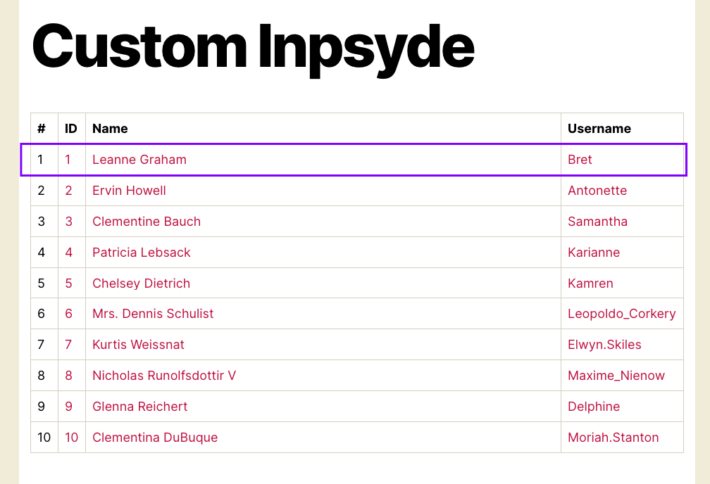

## Functioning like the requirements
- When access this URL (a custom endpoint) http://test-inpsyde-plugin.docker/?pagename=custom-inpsyde, a list of records taken from https://jsonplaceholder.typicode.com/users (as json) would be pulled and appears for user to see.
- Each row in the HTML table will show the details for a user. The column's id, name, and username are mandatory and display there.
